8位RISC CPU的Verilog实现
========================

一. 设计需求
------------

当今绝大多数计算机，无论是大型机还是微型机其基本结构都是冯诺依曼体系结构，即计算机由控制器，运算器，存储器，和输入/输出设备五部分组成。指令和程序都是存储在存储器中。

|image0|

中央处理器，也称微处理器（microprocessor），是计算机系统的核心。主要完成以下任务：（1）从存储器中取指令，指令译码；（2）执行简单的算数逻辑运算；（3）在处理器和存储器或I/O之间传送数据；（4）程序流向控制等[1]。

RISC，reduced instruction set
computer，精简指令集计算机相较于CISC，complex instruction set
computer，复杂指令集计算机能够在一个始终周期执行更多的指令，这些指令比CISC的指令集具有更短，功能更简单，指令格式更统一等特点，因此适合流水线处理，加快处理速度。

8位CPU是上世纪70年代开始采用的典型CPU结构，代表产品有因特尔的8080系列[1]。是现代普遍采用的64位，32位总线结构CPU的起始。

本文将基于有限状态机（Finite State Machine,
FSM）采用Verilog硬件描述语言对8位RISC架构CPU进行实现。

二. 硬件组成
------------

|image1|

如图是微型计算机系统中关键组成部分，包含CPU，存储器，数据和地址总线。CPU主要由算数逻辑单元（ALU，Arithmetic
Logic
Unit），累加器（accumulator），通用寄存器（registers），程序计数器（PC，Program
Counter），指令寄存器（IR，Instruction Register），地址选择器（address
multiplexer）组成。存储器这里指主存储器，分为随机存取存储器RAM（Radom
Access Memory）和只读存储器ROM（Read Only
Memory）。主存和CPU之间通过总线访问，总线有地址总线（Address
Bus）和数据总线（Data Address）两种。

2.1 存储器
~~~~~~~~~~

2.1.1 ROM
^^^^^^^^^

ROM用于存储要执行的指令，关于指令的介绍见第三章。

Verilog实现：

.. code:: verilog

   module rom(data, addr, read, ena);
   input read, ena;
   input [7:0] addr;
   output [7:0] data;
    
   reg [7:0] memory[255:0];

   // note: Decimal number in the bracket
   initial begin
       memory[0] = 8'b000_00000;   //NOP
       ... // some instructions
   end

   assign data = (read&&ena)? memory[addr]:8'hzz;  

   endmodule

ROM，只读指令。接受输入地址，当读信号和使能信号高电平时输出对应地址存储的指令，否则输出保持高阻态。地址和数据都是8位，可寻址以及内部存储的大小为256Bytes。

|image2|

RTL（register-transfer level，寄存器传输级）综合如上图所示。

2.2.2 RAM
^^^^^^^^^

存储数据，可读可写。

Verilog实现：

.. code:: verilog

   module ram(data, addr, ena, read, write);
   input ena, read, write;
   input [7:0] addr;
   inout [7:0] data;

   reg [7:0] ram[255:0];

   assign data = (read&&ena)? ram[addr]:8'hzz;     // read data from RAM

   always @(posedge write) begin   // write data to RAM
       ram[addr] <= data;
   end
   endmodule

可读可写，接收8位地址，当读信号和使能信号有效时，输出对应地址存储的数据，否则输出保持高阻态。当写信号上升沿是触发，将输入输出写入地址对应位置。内部存储以及可循址大小也为256Byters。

|image3|

RTL视图如上。

2.2 CPU
~~~~~~~

2.2.1 PC
^^^^^^^^

程序计数器，有时也叫做指令地址寄存器（Instruction Address Register,
IAR），对应于Intel X86体系CPU中的指令指针（Instruction
pointer）寄存器。其功能是用来存放要执行的下一条指令在现行代码段中的偏移地址。本文中PC由Controller自动修改，使得其中始终存放着下一条将要执行指令的地址。因此，PC是用来控制指令序列执行流程的寄存器[2]。

Verilog实现：

.. code:: verilog

   //PC, program counter
   module counter(pc_addr, clock, rst, en);
   input clock, rst, en;
   output reg [7:0] pc_addr;
   always @(posedge clock or negedge rst) begin
       if(!rst) pc_addr <= 8'd0;
       else begin
           if(en) pc_addr <= pc_addr+1;
           else pc_addr <= pc_addr;
       end
   end
   endmodule

异步清零。时钟上升沿触发，高电平使能时程序计数器计数，指向下一条要执行指令的地址。指令存储在ROM中，故每次pc_addr加1。

|image4|

RTL视图如上。

2.2.2 累加器
^^^^^^^^^^^^

累加器，用于储存计算的中间结果。

Verilog实现：

.. code:: verilog

   // Accumulator
   module accum( in, out, ena, clk, rst); 
   // a register, to storage result after computing
   input clk,rst,ena;
   input [7:0] in;
   output reg [7:0] out;

   always @(posedge clk or negedge rst) begin  
       if(!rst) out <= 8'd0;
       else begin
           if(ena) out <= in;
           else    out <= out;
       end
   end
   endmodule

异步清零。时钟上升沿触发，高电平使能时输出当前输入信号。

|image5|

RTL视图如上，可以看出其是一个Q触发器来实现。

2.2.3 地址选择器
^^^^^^^^^^^^^^^^

接受控制使能信号对输入的来自程序计数器和指令寄存器的地址进行选择。

Verilog实现：

.. code:: verilog

   // Address multiplexer
   module addr_mux(addr, sel, ir_ad, pc_ad); 
   // To choose address of instruction register or address of program counter
   input [7:0] ir_ad, pc_ad;
   input sel;
   output [7:0] addr;
   assign addr = (sel)? ir_ad:pc_ad;
   endmodule

当选择信号为1时，选择来自寄存器输入的地址到数据总线，否则将程序计数器中的地址加载到数据总线。

|image6|

RTL视图如上。

2.2.4 ALU
^^^^^^^^^

算术逻辑运算单元，根据指令类型来决定进行哪种运算，从而将运算结果输出通用寄存器或者累加器中。

.. code:: verilog

   module alu(alu_out, alu_in, accum, op);
   // Arithmetic logic unit
   // to perform arithmetic and logic operations.
   input [2:0] op;
   input [7:0] alu_in,accum;
   output reg [7:0] alu_out;

   parameter   NOP=3'b000,
               LDO=3'b001,
               LDA=3'b010,
               STO=3'b011,
               PRE=3'b100,
               ADD=3'b101,
               LDM=3'b110,
               HLT=3'b111;

   always @(*) begin
           casez(op)
           NOP:    alu_out = accum;
           HLT:    alu_out = accum;
           LDO:    alu_out = alu_in;
           LDA:    alu_out = alu_in;
           STO:    alu_out = accum;
           PRE:    alu_out = alu_in;
           ADD:    alu_out = accum+alu_in;
           LDM:    alu_out = accum;
           default:    alu_out = 8'bzzzz_zzzz;
           endcase
   end 
   endmodule

|image7|

RTL视图如上。

2.2.5 通用寄存器
^^^^^^^^^^^^^^^^

通用寄存器，ALU输出结果，指令寄存器输出的操作数都可以存储到寄存器中的特定的地址。输出寄存器中存储的数据到数据总线。

Verilog实现：

.. code:: verilog

   module reg_32(in, data, write, read, addr, clk);
   input write, read, clk;
   input [7:0] in;
   input [7:0] addr; 
   //!Warning: addr should be reduced to 5 bits width, not 8 bits width.
   //input [4:0] addr;

   output [7:0] data;

   reg [7:0] R[31:0]; //32Byte
   wire [4:0] r_addr;

   assign r_addr = addr[4:0];
   assign data = (read)? R[r_addr]:8'hzz;  //read enable

   always @(posedge clk) begin             //write, clk posedge
       if(write)   R[r_addr] <= in; 
   end
   endmodule

当写信号有效时，将输入数据（来自ALU的输出）存储到寄存器中的特定地址。当读信号有效时，将寄存器中特定位置的数据输出（到数据总线）。寄存器大小为32Bytes。

|image8|

RTL视图如上。

2.2.6 IR
^^^^^^^^

指令寄存器，从数据总线上获取数据，根据输入控制信号，根据指令类型将特定指令和地址输出到ALU，通用寄存器和地址选择器。

verilog实现:

.. code:: verilog

   // instruction register
   module ins_reg(data, fetch, clk, rst, ins, ad1, ad2);
   input clk, rst;
   input [1:0] fetch;
   input [7:0] data;
   output [2:0] ins;
   output [4:0] ad1;
   output [7:0] ad2;

   reg [7:0] ins_p1, ins_p2;
   reg [2:0] state;

   assign ins = ins_p1[7:5]; //hign 3 bits, instructions
   assign ad1 = ins_p1[4:0]; //low 5 bits, register address
   assign ad2 = ins_p2;

   always @(posedge clk or negedge rst) begin
       if(!rst) begin
           ins_p1 <= 8'd0;
           ins_p2 <= 8'd0;
       end
       else begin
           if(fetch==2'b01) begin          //fetch==2'b01 operation1, to fetch data from REG
               ins_p1 <= data;
               ins_p2 <= ins_p2;
           end
           else if(fetch==2'b10) begin     //fetch==2'b10 operation2, to fetch data from RAM/ROM
               ins_p1 <= ins_p1;
               ins_p2 <= data;
           end
           else begin
               ins_p1 <= ins_p1;
               ins_p2 <= ins_p2;
           end
       end
   end
   endmodule

异步清零。当输入控制信号为\ ``01``\ 时表示数据总线当前为指令（形式为指令编码+寄存器地址，见第三章），将其从\ ``ins``\ 和\ ``ad1``\ 输出，当控制信号为\ ``10``\ 时，表示当前数据总线上的为数据（8位地址数据，见第三章），将其从\ ``ad2``\ 输出到地址选择器。

|image9|

RTL视图如上。

2.3 内部结构（总）
~~~~~~~~~~~~~~~~~~

|image10|

如图是系统内部结构原理图，显示了各个部件之间的连接关系，数据总线和地址总线是总线系统的核心。其中地址总线连接了地址选择器的输出，ROM以及RAM的输入端。地址总线和ROM/RAM的输出，IR和ALU的输入，以及通用寄存器的输出相连。控制器controller（图左上方）是系统的控制单元，相关细节见第四章。

整个硬件系统使用元件例化语句的Verilog描述如下：

.. code:: verilog

   // Core
   // Top-level entity(except core-tb)
   module core(clk, rst);  
   input clk, rst;

   wire write_r, read_r, PC_en, ac_ena, ram_ena, rom_ena;
   wire ram_write, ram_read, rom_read, ad_sel;

   wire [1:0] fetch;
   wire [7:0] data, addr;
   wire [7:0] accum_out, alu_out;
   wire [7:0] ir_ad, pc_ad;
   wire [4:0] reg_ad;
   wire [2:0] ins;

   ram RAM1(.data(data), 
            .addr(addr), 
            .ena(ram_ena), 
            .read(ram_read), 
            .write(ram_write));  //module ram(data, addr, ena, read, write);

   rom ROM1(.data(data), 
            .addr(addr), 
            .ena(rom_ena), 
            .read(rom_read));    //module rom(data, addr, read, ena);

   addr_mux MUX1(.addr(addr), 
                 .sel(ad_sel), 
                 .ir_ad(ir_ad), 
                 .pc_ad(pc_ad)); //module addr_mux(addr, sel, ir_ad, pc_ad); 

   counter PC1(.pc_addr(pc_ad), 
               .clock(clk), 
               .rst(rst), 
               .en(PC_en));    //module counter(pc_addr, clock, rst, en);

   accum ACCUM1(.out(accum_out), 
                .in(alu_out), 
                .ena(ac_ena), 
                .clk(clk), 
                .rst(rst));        //module accum( in, out, ena, clk, rst); 

   alu ALU1(.alu_out(alu_out), 
            .alu_in(data), 
            .accum(accum_out), 
            .op(ins));             // module alu(alu_out, alu_in, accum, op);

   reg_32 REG1(.in(alu_out), 
               .data(data), 
               .write(write_r), 
               .read(read_r), 
               .addr({ins,reg_ad}), 
               .clk(clk)); 
    //module reg_32(in, data, write, read, addr, clk);
   //reg_32 REG1(.in(alu_out), .data(data), .write(write_r), .read(read_r), .addr(reg_ad), .clk(clk));     
    //module reg_32(in, data, write, read, addr, clk);

   ins_reg IR1(.data(data), 
               .fetch(fetch), 
               .clk(clk), 
               .rst(rst), 
               .ins(ins), 
               .ad1(reg_ad), 
               .ad2(ir_ad));   
   //module ins_reg(data, fetch, clk, rst, ins, ad1, ad2);

   //module machine(ins, clk, rst, write_r, read_r, PC_en, fetch, ac_ena, ram_ena, rom_ena,ram_write, ram_read, rom_read, ad_sel);
   controller CONTROLLER1(.ins(ins), 
                       .clk(clk), 
                       .rst(rst), 
                       .write_r(write_r), 
                       .read_r(read_r), 
                       .PC_en(PC_en), 
                       .fetch(fetch), 
                       .ac_ena(ac_ena), 
                       .ram_ena(ram_ena), 
                       .rom_ena(rom_ena),
                       .ram_write(ram_write), 
                       .ram_read(ram_read), 
                       .rom_read(rom_read), 
                       .ad_sel(ad_sel)
                       );
   endmodule

|image11|

各个模块进行例化后的系统总体RTL视图如上。

三. 指令集
----------

我们定义的RISC指令集长度类型两种，分别为短指令和长指令：

|image12|

|image13|

其中指令编码采用三位二进制表示，共定义有8种指令。短指令共8位，高三位为指令编码，低五位为通用寄存器地址。长指令为16位，每个长指令分两次取，每次取8位，首先取高8位，格式和短指令相通，也是高3位为指令编码，低5位为通用寄存器地址；第二次取低8位，表示ROM或者RAM地址，取决于指令编码。

因此有指令集如下表所示，为了方便理解指令的缩写含义，表中用英文进行了描述并将缩写的由来使用加粗来表示：

+---+---+---------------------------------------+---+---------------------+
| I | B | Description                           | T | Comment             |
| N | i |                                       | y |                     |
| S | n |                                       | p |                     |
|   | a |                                       | e |                     |
|   | r |                                       |   |                     |
|   | y |                                       |   |                     |
+===+===+=======================================+===+=====================+
| N | 0 | **N**\ o **op**\ eration              | S | 空操作              |
| O | 0 |                                       | h |                     |
| P | 0 |                                       | o |                     |
|   |   |                                       | r |                     |
|   |   |                                       | t |                     |
+---+---+---------------------------------------+---+---------------------+
| L | 0 | **L**\ oa\ **d**\ s the contents of   | L | REG[reg_addr]<-ROM[ |
| D | 0 | the R\ **O**\ M address into the REG  | o | ROM_addr]           |
| O | 1 | address                               | n |                     |
|   |   |                                       | g |                     |
+---+---+---------------------------------------+---+---------------------+
| L | 0 | **L**\ oa\ **d**\ s the contents of   | L | REG[reg_addr]<-RAM[ |
| D | 1 | the R\ **A**\ M address into the REG  | o | RAM_addr]           |
| A | 0 | address                               | n |                     |
|   |   |                                       | g |                     |
+---+---+---------------------------------------+---+---------------------+
| S | 0 | **Sto**\ re intermediate results into | L | RAM[RAM_addr]<-REG[ |
| T | 1 | RAM address                           | o | reg_addr]           |
| O | 1 |                                       | n |                     |
|   |   |                                       | g |                     |
+---+---+---------------------------------------+---+---------------------+
| P | 1 | **Pre**\ fetch Data from REG address  | S | ACCUM<-REG[reg_addr |
| R | 0 |                                       | h | ]                   |
| E | 0 |                                       | o |                     |
|   |   |                                       | r |                     |
|   |   |                                       | t |                     |
+---+---+---------------------------------------+---+---------------------+
| A | 1 | **Add**\ s the contents of the REG    | S | accumulator<-REG[re |
| D | 0 | address or integer to the accumulator | h | g_addr]+            |
| D | 1 |                                       | o | ACCUM               |
|   |   |                                       | r |                     |
|   |   |                                       | t |                     |
+---+---+---------------------------------------+---+---------------------+
| L | 1 | **Lo**\ ad **M**\ ultiple             | S | REG[reg_addr]<-ACCU |
| D | 1 |                                       | h | M                   |
| M | 0 |                                       | o |                     |
|   |   |                                       | r |                     |
|   |   |                                       | t |                     |
+---+---+---------------------------------------+---+---------------------+
| H | 1 | **H**\ a\ **lt**                      | S | 停机指令            |
| L | 1 |                                       | h |                     |
| T | 1 |                                       | o |                     |
|   |   |                                       | r |                     |
|   |   |                                       | t |                     |
+---+---+---------------------------------------+---+---------------------+

四. 控制器
----------

控制器是系统的核心，具有以下功能：取指令，指令排队，读写操作数，总线控制等。这里采用（Mealy型）有限状态机（FSM）来实现控制器，指令存储在ROM中来执行，控制器接受外界时钟和复位信号，控制器根据当前状态以及输入进行状态的转移。

4.1 状态转移图
~~~~~~~~~~~~~~

|image14|

根据指令的任务，我们设计了如上图所示的状态转移图，从左至右依次为状态Sidle，S0~S12。各个状态的含义如下：

============ ============== ===================================
Source State Description    Comment
============ ============== ===================================
S0           Load ir1       取指令1（短指令或者长指令的第一个）
S1           PC+1           每执行一条PC+1
S2           HLT            停机
S3           Load ir2       取指令2
S4           PC+1           每执行一条PC+1
S5           ROM/RAM to REG LDA/LDO
S6           Protect        写保护
S7           Read REG       STO第1阶段
S8           Write RAM      STO第2阶段
S9           Read REG       PRE/ADD，第1阶段
S10          Write ACCUM    PRE/ADD，第2阶段
S11          Write REG      LDM
S12          Protect        LDM
Sidle        Reset          重启
============ ============== ===================================

各个状态之间的转移有：

===== == == == == == == == == == == === === === =====
\     S0 S1 S2 S3 S4 S5 S6 S7 S8 S9 S10 S11 S12 Sidle
===== == == == == == == == == == == === === === =====
S0    1  0  0  0  0  0  0  0  0  0  0   0   0   1
S1    0  1  0  0  0  0  0  0  0  0  0   0   0   1
S2    0  0  1  0  0  0  0  0  0  0  0   0   0   1
S3    0  0  0  1  0  0  0  0  0  0  0   0   0   1
S4    0  0  0  0  1  0  0  0  0  0  0   0   0   1
S5    0  0  0  0  0  1  0  0  0  0  0   0   0   1
S6    0  0  0  0  0  0  1  0  0  0  0   0   0   1
S7    0  0  0  0  0  0  0  1  0  0  0   0   0   1
S8    0  0  0  0  0  0  0  0  1  0  0   0   0   1
S9    0  0  0  0  0  0  0  0  0  1  0   0   0   1
S10   0  0  0  0  0  0  0  0  0  0  1   0   0   1
S11   0  0  0  0  0  0  0  0  0  0  0   1   0   1
S12   0  0  0  0  0  0  0  0  0  0  0   0   1   1
Sidle 0  0  0  0  0  0  0  0  0  0  0   0   0   0
===== == == == == == == == == == == === === === =====

+--------+------------+-----------------------------------------------+
| Source | Destinatio | Condition                                     |
| State  | n          |                                               |
|        | State      |                                               |
+========+============+===============================================+
| S0     | S1         |                                               |
+--------+------------+-----------------------------------------------+
| S1     | S0         | (!ins[0]).(!ins[1]).(!ins[2])                 |
+--------+------------+-----------------------------------------------+
| S1     | S3         | (!ins[0]).(ins[1]).(!ins[2]) +                |
|        |            | (ins[0]).(!ins[2])                            |
+--------+------------+-----------------------------------------------+
| S1     | S11        | (!ins[0]).(ins[1]).(ins[2])                   |
+--------+------------+-----------------------------------------------+
| S1     | S9         | (!ins[1]).(ins[2])                            |
+--------+------------+-----------------------------------------------+
| S1     | S2         | (ins[0]).(ins[1]).(ins[2])                    |
+--------+------------+-----------------------------------------------+
| S2     | S2         |                                               |
+--------+------------+-----------------------------------------------+
| S3     | S4         |                                               |
+--------+------------+-----------------------------------------------+
| S4     | S7         | (!ins[0]).(!ins[1]) +                         |
|        |            | (!ins[0]).(ins[1]).(ins[2]) +                 |
|        |            | (ins[0]).(!ins[1]).(ins[2]) +                 |
|        |            | (ins[0]).(ins[1])                             |
+--------+------------+-----------------------------------------------+
| S4     | S5         | (!ins[0]).(ins[1]).(!ins[2]) +                |
|        |            | (ins[0]).(!ins[1]).(!ins[2])                  |
+--------+------------+-----------------------------------------------+
| S5     | S6         |                                               |
+--------+------------+-----------------------------------------------+
| S6     | S0         |                                               |
+--------+------------+-----------------------------------------------+
| S7     | S8         |                                               |
+--------+------------+-----------------------------------------------+
| S8     | S0         |                                               |
+--------+------------+-----------------------------------------------+
| S9     | S10        |                                               |
+--------+------------+-----------------------------------------------+
| S10    | S0         |                                               |
+--------+------------+-----------------------------------------------+
| S11    | S12        |                                               |
+--------+------------+-----------------------------------------------+
| S12    | S0         |                                               |
+--------+------------+-----------------------------------------------+
| Sidle  | S0         |                                               |
+--------+------------+-----------------------------------------------+

例如我们可以看到S0，S1的状态转移：

|image15|

|image16|

详情请见附件\ ``fsm.pdf``\ 。

关于图示有限状态机的verilog实现，这里采用了经典的3段式结构：状态寄存器（state
register），下一个状态组合逻辑电路（Next-state combinational
logic），输出组合逻辑电路（Output combinational logic）。

4.2 FSM之状态寄存器
~~~~~~~~~~~~~~~~~~~

本质是一个D触发器，负责将下一个状态赋给当前状态值（即跳转到下一个状态），异步清零。

.. code:: verilog

   //PART A: D flip latch; State register
   always @(posedge clk or negedge rst) 
   begin
       if(!rst) state<=Sidle;
           //current_state <= Sidle;
       else state<=next_state;
           //current_state <= next_state;  
   end

4.3 FSM之下一个状态组合逻辑
~~~~~~~~~~~~~~~~~~~~~~~~~~~

负责控制状态的转移，这里下一个状态跟当前状态\ ``state``\ 以及输入\ ``ins``\ 均有关，属于Mealy型状态机。

.. code:: verilog

   //PART B: Next-state combinational logic
   always @*
   begin
   case(state)
   S1:     begin
               if (ins==NOP) next_state=S0;
               else if (ins==HLT)  next_state=S2;
               else if (ins==PRE | ins==ADD) next_state=S9;
               else if (ins==LDM) next_state=S11;
               else next_state=S3;
           end

   S4:     begin
               if (ins==LDA | ins==LDO) next_state=S5;
               //else if (ins==STO) next_state=S7; 
               else next_state=S7; // ---Note: there are only 3 long instrucions. So, all the cases included. if (counter_A==2*b11)
           end
   Sidle:  next_state=S0;
   S0:     next_state=S1;
   S2:     next_state=S2;
   S3:     next_state=S4;
   S5:     next_state=S6;
   S6:     next_state=S0;
   S7:     next_state=S8;
   S8:     next_state=S0;
   S9:     next_state=S10;
   S10:    next_state=S0;
   S11:    next_state=S12;
   S12:    next_state=S0;
   default: next_state=Sidle;
   endcase
   end

4.4 FSM之输出组合逻辑
~~~~~~~~~~~~~~~~~~~~~

输出组合逻辑电路根据当前状态以及输入命令，来确定输出值。

由于篇幅较长，见附录。

五. 测试及结果
--------------

为了验证RISC CPU功能的正确与否，下面进行芯片进行测试。

5.1 测试指令
~~~~~~~~~~~~

ROM中存储的指令如下：

.. code:: verilog

   // note: Decimal number in the bracket
   initial begin
       memory[0] = 8'b000_00000;   //NOP

       memory[1] = 8'b001_00001;   //LDO s1
       memory[2] = 8'b010_00001;   //rom(65)   //end, reg[1]<-rom[65]
       memory[3] = 8'b001_00010;   //LDO s2
       memory[4] = 8'b010_00010;   //rom(66)   //end, reg[2]<-rom[66]
       memory[5] = 8'b001_00011;   //LDO s3
       memory[6] = 8'b010_00011;   //rom(67)   //end, reg[3]<-rom[67] 

       memory[7] = 8'b100_00001;   //PRE s1
       memory[8] = 8'b101_00010;   //ADD s2
       memory[9] = 8'b110_00001;   //LDM s1  // REG[1] <- REG[1]+REG[2]
       
       memory[10] = 8'b011_00001;  //STO s1
       memory[11] = 8'b000_00001;  //ram(1)  // RAM[1] <- REG[1]
       memory[12] = 8'b010_00010;  //LDA s2
       memory[13] = 8'b000_00001;  //ram(1)  // REG[2] <- RAM[1]
       
       memory[14] = 8'b100_00011;  //PRE s3
       memory[15] = 8'b101_00010;  //ADD s2
       memory[16] = 8'b110_00011;  //LDM s3  // REG[3] <- REG[2]+REG[3]
       
       memory[17] = 8'b011_00011;  //STO s3
       memory[18] = 8'b000_00010;  //ram(2)   //REG[3] -> ram[2]
       memory[19] = 8'b111_00000;  //HLT   
       
       memory[65] = 8'b001_00101;  //37
       memory[66] = 8'b010_11001;  //89
       memory[67] = 8'b001_10101;  //53
   end

指令按照顺序执行，最终的结果是将ROM中的65，66，67位的三个数进行加法，存储到RAM[2]中，即实现三个数的加法，于此同时RAM[1]存放着前两个数加法的和。

5.2 Test-Bench
~~~~~~~~~~~~~~

为了测试系统的功能，这里生成/编写test-bench文件，用于仿真：

.. code:: verilog

   `timescale 1ps / 1ps
   module core_tb_00  ; 
    
     reg    rst   ; 
     reg    clk   ; 
     core  
      DUT  ( 
          .rst (rst ) ,
         .clk (clk ) ); 

   // "Clock Pattern" : dutyCycle = 50
   // Start Time = 0 ps, End Time = 10 ns, Period = 100 ps
     initial
     begin
         clk  = 1'b0  ;
        # 150 ;
   // 50 ps, single loop till start period.
      repeat(99)
      begin
          clk  = 1'b1  ;
         #50  clk  = 1'b0  ;
         #50 ;
   // 9950 ps, repeat pattern in loop.
      end
         clk  = 1'b1  ;
        # 50 ;
   // dumped values till 10 ns
     end

   // "Constant Pattern"
   // Start Time = 0 ps, End Time = 10 ns, Period = 0 ps
     initial
     begin
         rst  = 1'b0  ;
        # 100;
       rst=1'b1;
        # 9000 ;
   // dumped values till 10 ns
     end

     initial
   #20000 $stop;
   endmodule

只需要给CPU两个信号，激励时钟\ ``clk``\ 和异步复位信号\ ``rst``\ 。

5.3 波形
~~~~~~~~

|image17|

根据ModelSIM仿真结果，如上图所示累加器输出最终结果179，在最后的停机指令前（图中6300ps处），addr地址为2，data为179，ram写，使能信号均为1，将最终结果写入到了RAM[2]中，指令指令结果无误。

从仿真波形中，不仅可以看出每个控制信号在每个时刻的状态，还可以看出每条指令执行的状态机的状态转换信息：

|image18|

如图所示，从波形可以看出执行一个LDO长指令消耗了6个时钟周期，NOP指令消耗了两个时钟周期，和状态转换图一致，得到的结果和测试指令的输出要求一致。

|image19|

如图是两个最重要的用来验证功能正确性的两个时刻，从波形可以看出，相应的计算结果126，179分别被写到了RAM的地址第1，2位置，相关控制信号正常。即达到了我们设计的功能。更多关于波形的情况，见附件即仿真源文件。

六. 结论
--------

本文构建了8位的RISC
CPU，详细介绍了设计过程和实验测试，包括：硬件组成，指令集系统等。重点在于控制器的设计，基于有限状态机，实现了指令和状态之间的对应和转移，并进行了详实的仿真实验，结果证明CPU功能正常，达到了预期。

参考文献
--------

[1]周荷琴, 吴秀清.
微型计算机原理和接口技术（第三版）.中国科学技术大学出版社. 2008.

附录
----

**附录A Controller的Verilog实现**

.. code:: verilog

   module controller(ins, clk, rst, write_r, read_r, PC_en, fetch, ac_ena, ram_ena, rom_ena,ram_write, ram_read, rom_read, ad_sel);

   input clk, rst;         // clock, reset
   input [2:0] ins;        // instructions, 3 bits, 8 types

   // Enable signals
   output reg write_r, read_r, PC_en, ac_ena, ram_ena, rom_ena;

   // ROM: where instructions are storaged. Read only.
   // RAM: where data is storaged, readable and writable.
   output reg ram_write, ram_read, rom_read, ad_sel;

   output reg [1:0] fetch;     // 01: to fetch from RAM/ROM; 10: to fetch from REG

   // State code(current state)
   reg [3:0] state;        // current state
   reg [3:0] next_state;   // next state

   // instruction code
   parameter   NOP=3'b000, // no operation
               LDO=3'b001, // load ROM to register
               LDA=3'b010, // load RAM to register
               STO=3'b011, // Store intermediate results to accumulator
               PRE=3'b100, // Prefetch Data from Address
               ADD=3'b101, // Adds the contents of the memory address or integer to the accumulator
               LDM=3'b110, // Load Multiple
               HLT=3'b111; // Halt

   // state code            
   parameter Sidle=4'hf,
                S0=4'd0,
                S1=4'd1,
                S2=4'd2,
                S3=4'd3,
                S4=4'd4,
                S5=4'd5,
                S6=4'd6,
                S7=4'd7,
                S8=4'd8,
                S9=4'd9,
                S10=4'd10,
                S11=4'd11,
                S12=4'd12;
                
   //PART A: D flip latch; State register
   always @(posedge clk or negedge rst) 
   begin
       if(!rst) state<=Sidle;
           //current_state <= Sidle;
       else state<=next_state;
           //current_state <= next_state;  
   end

   //PART B: Next-state combinational logic
   always @*
   begin
   case(state)
   S1:     begin
               if (ins==NOP) next_state=S0;
               else if (ins==HLT)  next_state=S2;
               else if (ins==PRE | ins==ADD) next_state=S9;
               else if (ins==LDM) next_state=S11;
               else next_state=S3;
           end

   S4:     begin
               if (ins==LDA | ins==LDO) next_state=S5;
               //else if (ins==STO) next_state=S7; 
               else next_state=S7; // ---Note: there are only 3 long instrucions. So, all the cases included. if (counter_A==2*b11)
           end
   Sidle:  next_state=S0;
   S0:     next_state=S1;
   S2:     next_state=S2;
   S3:     next_state=S4;
   S5:     next_state=S6;
   S6:     next_state=S0;
   S7:     next_state=S8;
   S8:     next_state=S0;
   S9:     next_state=S10;
   S10:    next_state=S0;
   S11:    next_state=S12;
   S12:    next_state=S0;
   default: next_state=Sidle;
   endcase
   end

   // another style
   //PART C: Output combinational logic
   always@*
   begin 
   case(state)
   // --Note: for each statement, we concentrate on the current state, not next_state
   // because it is combinational logic.
     Sidle: begin
            write_r=1'b0;
            read_r=1'b0;
            PC_en=1'b0; 
            ac_ena=1'b0;
            ram_ena=1'b0;
            rom_ena=1'b0;
            ram_write=1'b0;
            ram_read=1'b0;
            rom_read=1'b0;
            ad_sel=1'b0;
            fetch=2'b00;
            end
        S0: begin // load IR
            write_r=0;
            read_r=0;
            PC_en=0;
    ac_ena=0;
            ram_ena=0;
            rom_ena=1;
            ram_write=0;
            ram_read=0;
            rom_read=1;
            ad_sel=0;
            fetch=2'b01;
            end
        S1: begin
            write_r=0;
            read_r=0;
            PC_en=1; 
            ac_ena=0;
            ram_ena=0;
            ram_write=0;
            ram_read=0;
            rom_ena=1;
            rom_read=1; 
            ad_sel=0;
            fetch=2'b00;
            end
        S2: begin
            write_r=0;
            read_r=0;
            PC_en=0;
            ac_ena=0;
            ram_ena=0;
            rom_ena=0;
            ram_write=0;
            ram_read=0;
            rom_read=0;
            ad_sel=0;
            fetch=2'b00;
            end
        S3: begin 
            write_r=0;
            read_r=0;
            PC_en=0;
            ac_ena=1; 
            ram_ena=0;
            rom_ena=1;
            ram_write=0;
            ram_read=0;
            rom_read=1;
            ad_sel=0;
            fetch=2'b10; 
            end
   S4: begin
            write_r=0;
            read_r=0;
            PC_en=1;
            ac_ena=1;
            ram_ena=0;
            ram_write=0;
            ram_read=0;
            rom_ena=1; 
            rom_read=1;
            ad_sel=0;
            fetch=2'b10; 
            end
        S5: begin
            if (ins==LDO)
            begin
            write_r=1;
            read_r=0;
            PC_en=0;
            ac_ena=1;
            ram_ena=0;
            ram_write=0;
            ram_read=0;
            rom_ena=1;
            rom_read=1;
            ad_sel=1;
            fetch=2'b01;        
            end
            else 
            begin
            write_r=1;
            read_r=0;
            PC_en=0;
            ac_ena=1;
            ram_ena=1;
            ram_write=0;
            ram_read=1;
            rom_ena=0;
            rom_read=0;
            ad_sel=1;
            fetch=2'b01;
            end     
            end
        S6: begin 

        write_r=1'b0;
            read_r=1'b0;
            PC_en=1'b0; //** not so sure, log: change 1 to 0
            ac_ena=1'b0;
            ram_ena=1'b0;
            rom_ena=1'b0;
            ram_write=1'b0;
            ram_read=1'b0;
            rom_read=1'b0;
            ad_sel=1'b0;
            fetch=2'b00;
       end

        S7: begin // STO, reg->ram. step1. read REG
            write_r=0;
            read_r=1;
            PC_en=0;
            ac_ena=0;
            ram_ena=0;
            rom_ena=0;
            ram_write=0;
            ram_read=0;
            rom_read=0;
            ad_sel=0;
            fetch=2'b00;
            end
        S8: begin // STO, step2, write RAM
            write_r=0;
            read_r=1;
            PC_en=0;
            ac_ena=0;
            rom_read=0;
            rom_ena=0;

            ram_ena=1;
            ram_write=1;
            ram_read=0;

            ad_sel=1;
            fetch=2'b00; //fetch=2'b10, ram_ena=1, ram_write=1, ad_sel=1;
            end
        S9: begin 
            if (ins==PRE) // REG->ACCUM
            begin
            write_r=0;
            read_r=1;
            PC_en=0;
            ac_ena=1;
            ram_ena=0;
            rom_ena=0;
            ram_write=0;
            ram_read=0;
            rom_read=0;
            ad_sel=0;
            fetch=2'b00;
            end
            else 
            begin 
            write_r=0;
            read_r=1;
            PC_en=0;
            ac_ena=1;
            ram_ena=0;
            rom_ena=0;
            ram_write=0;
            ram_read=0;
            rom_read=0;
            ad_sel=0;
    
            fetch=2'b00;        
            end 
            end
       S10: begin
            write_r=0;
            read_r=1;
            PC_en=0;
            ac_ena=0;
            ram_ena=0;
            rom_ena=0;
            ram_write=0;
            ram_read=0;
            rom_read=0;
            ad_sel=0;
            fetch=2'b00;
            end
       S11: begin // LDM, step1, write reg
            write_r=1;
            read_r=0;
            PC_en=0;
            ac_ena=1;
            ram_ena=0;
           
            ram_write=0;
            ram_read=0;
            rom_ena=1;
            rom_read=1;
            ad_sel=0;
            fetch=2'b00;
                   
            end
       S12: begin 
            write_r=0;
            read_r=0;
            PC_en=0;
            ac_ena=0;
            ram_ena=0;
            rom_ena=0;
            ram_write=0;
            ram_read=0;
            rom_read=0;
            ad_sel=0;
            fetch=2'b00;    
            end
   default: begin
            write_r=0;
            read_r=0;
            PC_en=0;
            ac_ena=0;
            ram_ena=0;
            rom_ena=0;
            ram_write=0;
            ram_read=0;
            rom_read=0;
            ad_sel=0;
            fetch=2'b00;        
            end
   endcase
   end
   endmodule

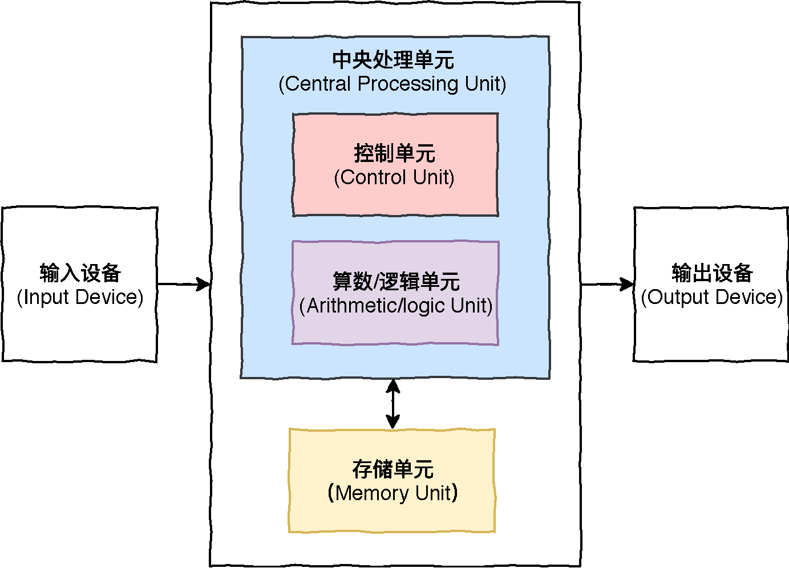
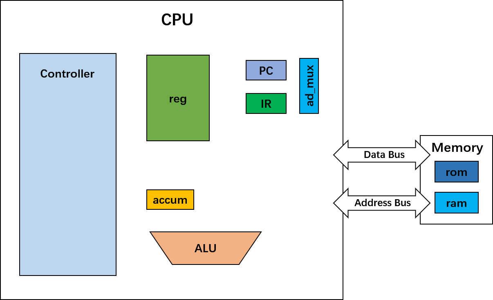
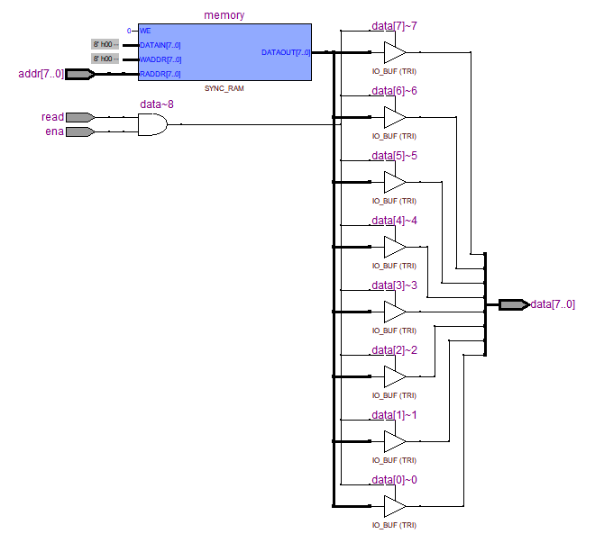
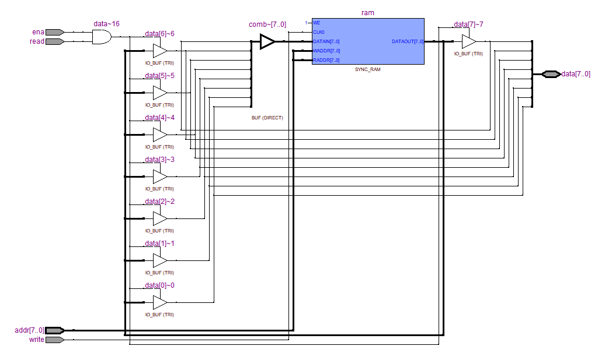
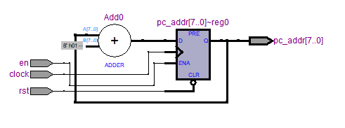
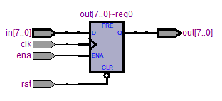
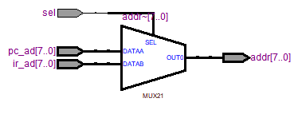
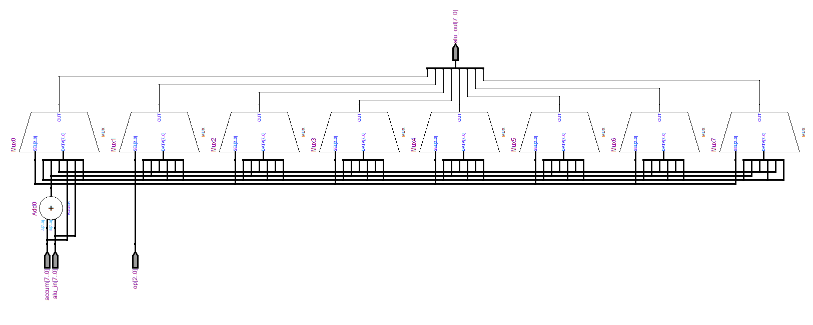
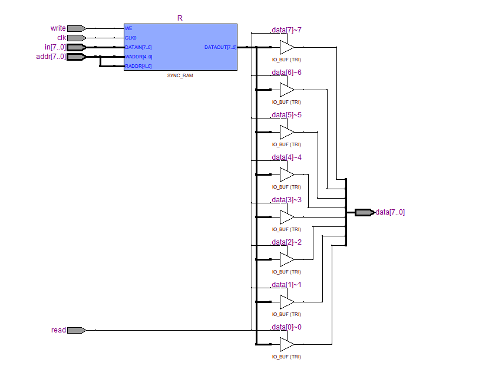
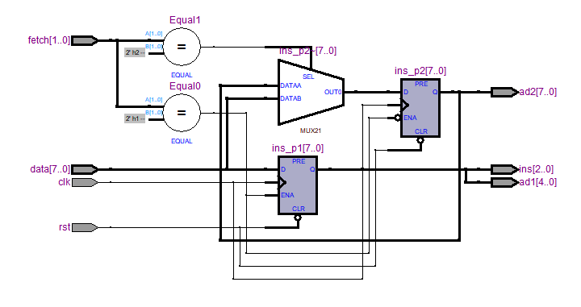
.. |image10| image:: assets/schematic.png
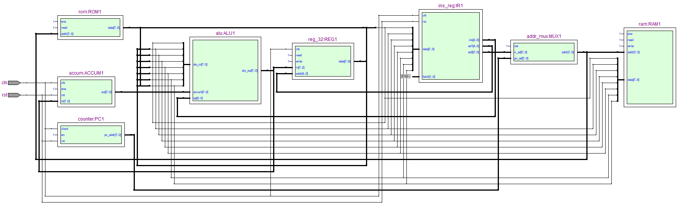

.. |image13| image:: assets/short-long-caption.png
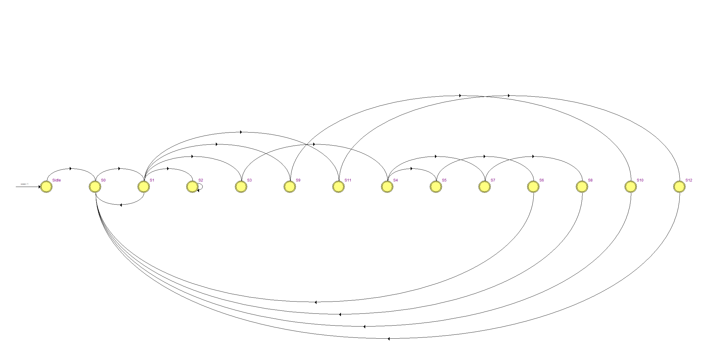
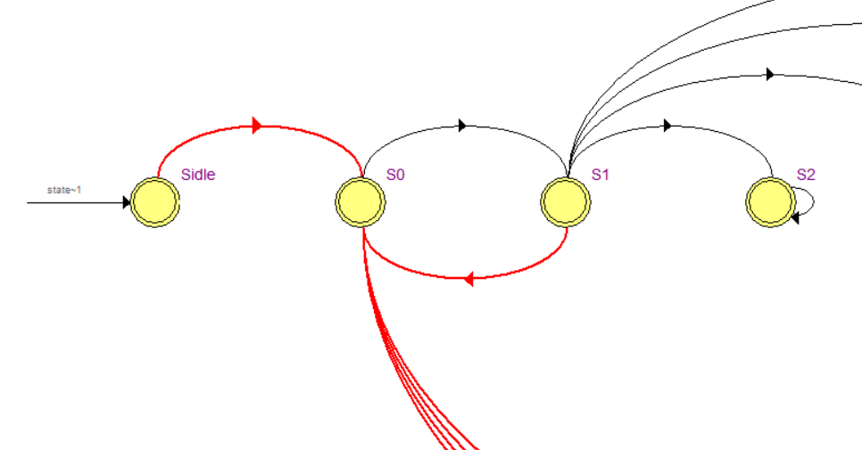
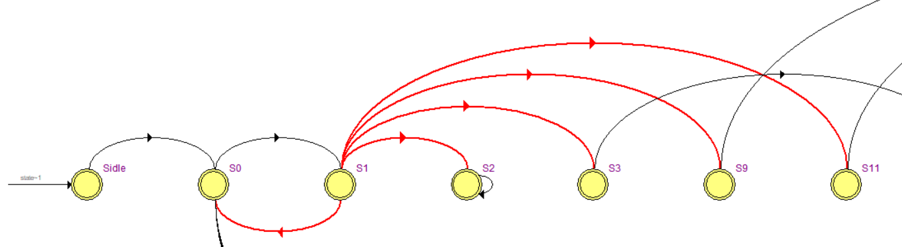
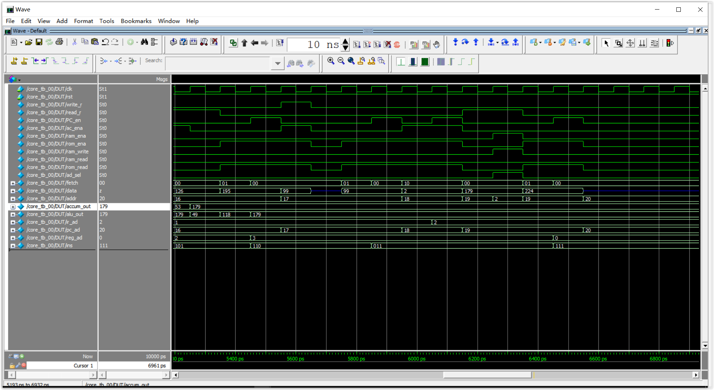
.. |image18| image:: assets/mv3.png
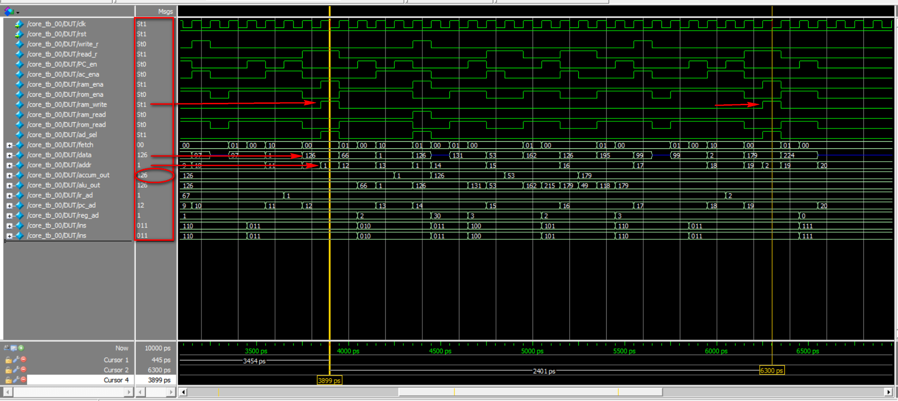

